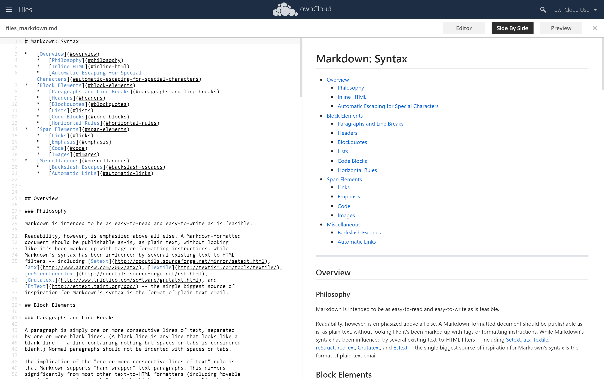

# ownCloud Markdown Editor

Extends the text editor in ownCloud with a live preview of markdown files. Inspiration taken from Nextcloud's [files_markdown](https://github.com/icewind1991/files_markdown) (if you back track a heap of commits)

The previewer has 3 separate views:
* Editor only
* Side by side (editor and preview)
* Preview only

The editor uses the following plugins for rendering markdown:
* [markdown-it](https://github.com/markdown-it/markdown-it) for the initial parsing of the markdown
* [markdown-it-texmath](https://github.com/goessner/markdown-it-texmath) - this allows support for TeX math which is rendered using KaTeX. This can be used by surrounding math in `$$`.
* [markdown-it-checkboxes](https://github.com/benjycui/markdown-it-checkboxes) - this allows the `[ ]` and `[X]` operator for rendering checkboxes
* [markdown-it-for-inline](https://github.com/benjycui/markdown-it-for-inline) - this is used to allow inline images from your ownCloud (eg. ``) and for the link anchors to work within the markdown preview.
* [markdown-it-anchor](https://github.com/valeriangalliat/markdown-it-anchor) - used for modifying the anchors to work within the markdown preview.
* [highlightjs](https://highlightjs.org/) - for syntax highlighting

The CSS for the markdown preview is taken from sindresorhus's [github-markdown-css](https://github.com/sindresorhus/github-markdown-css) for a familiar look and feel.

Requirements
---

This requires ownCloud and the files_texteditor app to be installed.

Installation
---

- Clone the app into the ownCloud apps directory:

    `git clone https://github.com/mdusher/files_markdown.git`

- Activate the app via the ownCloud web interface or via:

    `occ app:enable files_markdown`
